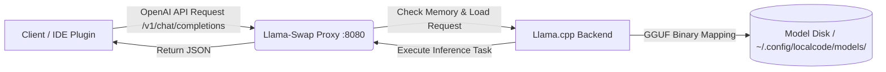

<div align="center">
  
  <h1>LocalCode</h1>
  <p><strong>A streamlined, developer-first command-line utility for dynamically launching and swapping open-weights Large Language Models (LLMs).</strong></p>

  <p>LocalCode acts as the invisible intelligence backbone, abstracting away container management, hardware-based model selection, and memory constraints so you can focus on building.</p>

  <p>
    <a href="https://github.com/thewulf7/localcode/actions"></a>
    <a href="https://crates.io/crates/localcode"></a>
    <a href="https://github.com/thewulf7/localcode/blob/master/LICENSE"></a>
  </p>
</div>

---

## 🚀 Key Features

*   **Intelligent Hardware Profiling:** Uses `llmfit-core` to auto-detect system RAM and VRAM capability, recommending the maximum context lengths and quantizations native to your machine. No more out-of-memory errors!
*   **Dual Model Combos:** Automatically suggests ideal combinations of large reasoning models alongside lightning-fast **autocomplete models** based strictly on your available VRAM footprint.
*   **Dynamic Swapping:** Seamlessly switches models in and out of memory at the proxy layer using ghcr.io/mostlygeek/llama-swap. Request a different `.gguf` and watch it instantly swap.
*   **Zero Port Conflicts:** Both your heavy chat model and your instantaneous autocomplete model run on the *exact same port* (`8080`). The proxy handles the routing natively.
*   **Global & Project Contexts:** Store state globally or override properties explicitly across projects (`localcode init`).
*   **One-Line Installation:** Install immediately with secure OS-specific scripts without requiring a Rust toolchain.

---

## 🛠️ Prerequisites

LocalCode runs via Containerization. You must have:

*   **Docker Desktop** or **Podman** installed on the host OS.
*   If utilizing Nvidia Acceleration on Windows, you must configure **WSL2 passthrough** and have the **NVIDIA Container Toolkit** correctly mapped.
*   Minimum 8 GB RAM (16 GB+ is strongly recommended for practical inference scaling).

---

## ⚡ Getting Started

### 1. Installation

**For Linux / macOS:**
```bash
curl -sL https://raw.githubusercontent.com/thewulf7/localcode/master/install.sh | sh
```

**For Windows (PowerShell):**
```powershell
irm https://raw.githubusercontent.com/thewulf7/localcode/master/install.ps1 | iex
```

*<small>Alternatively, if you have a Rust toolchain installed, you can build from source: `cargo install --git https://github.com/thewulf7/localcode.git`</small>*

### 2. Initial Setup

Configure your models and directories for the first time. LocalCode will guide you interactively, recommend the best weights, and download them automatically from Hugging Face:

```bash
localcode setup
```
*(During setup, if your hardware supports it, LocalCode will suggest **Combo Models**! This automatically spins up logic to allocate `llm` and `tabAutocompleteModel` targets beautifully for OpenCode.)*

**Headless Setup (CI/CD / Automation):**
You can also bypass the prompts by providing arguments directly:
```bash
localcode setup --yes -m "llama3-8b-instruct" -m "qwen2.5-coder-1.5b-instruct"
```

### 3. Starting the Environment

Deploys the reverse proxy mapping across Docker and orchestrates the weights:

```bash
localcode start
```

### 4. Verification and Shutdown

Once running, verify the status or shut down the container gracefully:

```bash
# Check the container lifecycle and proxy mapping
localcode status

# Stop background services
localcode stop
```

---

## 🏛️ Architecture

LocalCode is composed explicitly of highly predictable, independent components communicating via a local service mesh structure. 

### Directory Structure & Config Map
The system uses the `~/.config/localcode/` directory (or OS equivalent) to maintain its global definition map. 

```
~/.config/localcode/
 ├── localcode.json       # Central Configuration State
 └── models/              # Downloaded HuggingFace GGUF Weights
```

*Note: You can override your model path explicitely using `localcode setup --models-dir /my/custom/path`.*

### Request Lifecycle Flow

When an inference call is made from OpenCode (or any frontend), LocalCode abstracts the execution:



1. **Proxy Intercept:** The reverse proxy `llama-swap` listens continuously. 
2. **Context Resolution:** The proxy observes the requested model string in the payload.
3. **Weight Loading:** If the specific `.gguf` is not in RAM/VRAM, the backend immediately purges the oldest inactive model and cycles the requested parameters into active memory.
4. **Execution:** The inference runs cleanly across `llama.cpp`.

---

## 📝 Configuration (Project-Level Overrides)

Need specific models locally configured just for one project boundary? You can initialize a discrete scope overriding the Global `.config`:

Navigate to your target directory and run:

```bash
localcode init
```

This deposits a minimal `./localcode.json` map right in your codebase directory. The system will inherently respect this scope hierarchy the next time you invoke `localcode start` from that directory!

---

## 🆘 Troubleshooting

### `NVIDIA Container Toolkit not detected`
**Symptom:** During `localcode start`, Docker attempts to access the GPU (`--gpus all`) and the initialization crashes. 
**Solution:** Ensure you've cleanly installed runtime configurations for Windows WSL mapped drivers. If GPU allocation is irreversibly misconfigured, LocalCode acts gracefully by catching the Docker API bounds error and injecting `--gpus 0`, enabling immediate **CPU fallback processing**.

### Download Times Out Setting Up Models
**Symptom:** `localcode setup` halts indefinitely while fetching GGUF weights.
**Solution:** The internal handler syncs securely with Hugging Face Hub limits. Ensure your network doesn't possess SSL inspection hooks obstructing standard HTTPS payload transfers. You can safely abort (`Ctrl+C`) and retry `localcode setup`, and the internal downloader will gracefully resume the cached blob segments.

---

## 🤝 Contributing
Contributions, issues, and feature requests are welcome!
Feel free to check [issues page](https://github.com/thewulf7/localcode/issues).  

When submitting PRs, ensure you adhere to the project's formatting by executing:
```sh
cargo clippy -- -D warnings
cargo fmt --check
cargo test
```
