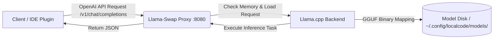

<div align="center">
  
  <h1>LocalCode</h1>
  <p><strong>A streamlined, developer-first command-line utility for dynamically launching and swapping open-weights Large Language Models (LLMs).</strong></p>

  <p>LocalCode acts as the invisible intelligence backbone, abstracting away container management, hardware-based model selection, and memory constraints so you can focus on building.</p>

  <p>
    <a href="https://github.com/thewulf7/localcode/actions"></a>
    <a href="https://crates.io/crates/localcode"></a>
    <a href="https://github.com/thewulf7/localcode/blob/master/LICENSE"></a>
  </p>
</div>

---

## 🚀 Key Features

*   **Intelligent Hardware Profiling:** Uses `llmfit-core` to auto-detect system RAM and VRAM capability, recommending the maximum context lengths and quantizations native to your machine. No more out-of-memory errors!
*   **Dual Model Combos:** Automatically suggests ideal combinations of large reasoning models alongside lightning-fast **autocomplete models** based strictly on your available VRAM footprint.
*   **Dynamic Swapping:** Seamlessly switches models in and out of memory at the proxy layer using `ghcr.io/mostlygeek/llama-swap`. Request a different `.gguf` and watch it instantly swap.
*   **Zero Port Conflicts:** Both your heavy chat model and your instantaneous autocomplete model run on the *exact same port* (`8080`). The proxy handles the routing natively.
*   **Model Discovery:** Automatically scans known cache locations — **Ollama**, **LM Studio**, and any custom directory — so you can reuse weights you already have on disk (`localcode ls`).
*   **Configurable llama.cpp Args:** Fine-tune GPU layers, context size, KV cache quantization, flash attention, and any other `llama.cpp` parameter directly in `localcode.json`.
*   **Global & Project Contexts:** Store state globally or override properties explicitly across projects (`localcode init`).
*   **One-Line Installation:** Install immediately with secure OS-specific scripts without requiring a Rust toolchain.
*   **Self-Upgrade:** Update the binary in-place from GitHub releases (`localcode upgrade`).

---

## 🛠️ Prerequisites

LocalCode runs via containerization. You must have:

*   **Docker Desktop** or **Podman** installed on the host OS.
*   If utilizing NVIDIA acceleration on Windows, you must configure **WSL2 passthrough** and have the **NVIDIA Container Toolkit** correctly mapped.
*   Minimum **8 GB RAM** (16 GB+ is strongly recommended for practical inference scaling).

---

## ⚡ Quick Start

### 1. Installation

**For Linux / macOS:**
```bash
curl -sL https://appcabin.io/install.sh | sh
```

**For Windows (PowerShell):**
```powershell
irm https://appcabin.io/install.ps1 | iex
```

*<small>Alternatively, if you have a Rust toolchain installed, you can build from source: `cargo install --git https://github.com/thewulf7/localcode.git`</small>*

### 2. Initial Setup

Configure your models and directories for the first time. LocalCode will profile your hardware, recommend model/quantization combos, and download them automatically from Hugging Face:

```bash
localcode init
```

During setup you will be prompted to choose:
- **Scope** — Local (current project) or Global (`~/.config/localcode/`).
- **Model Mode** — Single model or a Normal + Autocomplete combo.
- **Models** — Picked from hardware-profiled recommendations filtered for coding tasks.
- **Docker** — Whether to use the Docker-based llama.cpp backend.
- **Models directory** — Where to store downloaded GGUF weights.

**Headless Setup (CI/CD / Automation):**
```bash
localcode init --yes --global -m "llama3-8b-instruct" -m "qwen2.5-coder-1.5b-instruct"
```

### 3. Start the Server

Deploys the reverse proxy mapping across Docker and orchestrates the weights:

```bash
localcode start
```

### 4. Status & Shutdown

```bash
# Check the container lifecycle and proxy mapping
localcode status

# Stop background services
localcode stop
```

### 5. Discover Local Models

List all `.gguf` weights already present on your system (Ollama, LM Studio, or any configured directory):

```bash
localcode ls
```

### 6. Self-Update

```bash
localcode upgrade
```

> 📖 **For a complete command reference, configuration guide, and troubleshooting docs see [GUIDE.md](GUIDE.md).**

---

## 🏛️ Architecture

LocalCode is composed of highly predictable, independent components communicating via a local service mesh structure.

### Directory Structure & Config Map

The system uses `~/.config/localcode/` (or OS equivalent) to maintain its global definition map:

```
~/.config/localcode/
 ├── localcode.json       # Central Configuration State
 └── models/              # Downloaded HuggingFace GGUF Weights (default)
```

*Note: You can override your model path explicitly using `localcode init --models-dir /my/custom/path`.*

### Request Lifecycle Flow

When an inference call is made from OpenCode (or any frontend), LocalCode abstracts the execution:


```mermaid
graph LR
    A[Client / IDE Plugin] -->|OpenAI API Request /v1/chat/completions| B(Llama-Swap Proxy :8080)
    B -->|Check Memory & Load Request| C[Llama.cpp Backend]
    C -->|GGUF Binary Mapping| D[(Model Disk / ~/.config/localcode/models/)]
    C -->|Execute Inference Task| B
    B -->|Return JSON| A
```

1. **Proxy Intercept:** The reverse proxy `llama-swap` listens continuously.
2. **Context Resolution:** The proxy observes the requested model string in the payload.
3. **Weight Loading:** If the specific `.gguf` is not in RAM/VRAM, the backend immediately purges the oldest inactive model and cycles the requested parameters into active memory.
4. **Execution:** The inference runs cleanly across `llama.cpp`.

### Model Discovery

`localcode ls` scans three sources to find existing `.gguf` weights:

| Source | Path |
|--------|------|
| **LocalCode Config** | The directory specified in `localcode.json` → `models_dir` |
| **Ollama** | `~/.ollama/models/blobs/` (parsed from manifests) |
| **LM Studio** | `~/.cache/lm-studio/models/` |

---

## 📝 Configuration

### Project-Level Overrides

Need specific models configured just for one project? `localcode init` defaults to local scope. To explicitly use global scope instead:

```bash
localcode init --global
```

A local `./localcode.json` in the working directory always takes precedence over the global configuration.

### llama.cpp Server Arguments

The `llama_server_args` key in `localcode.json` controls how the llama.cpp backend is launched. These are auto-populated based on your hardware during `init`, but you can manually tune them:

```json
{
  "llama_server_args": {
    "ctx_size": 8192,
    "n_gpu_layers": 999,
    "flash_attn": true,
    "cache_type_k": "q8_0",
    "cache_type_v": "q8_0",
    "prompt-cache": "/models/prompt.cache",
    "prompt-cache-all": true
  }
}
```

Any additional key-value pairs are passed through directly as `--key value` flags to the llama.cpp server.

---

## 🔌 Client Configuration

Once the server is running, you can connect your favorite AI-powered coding tools.

### 1. OpenCode

To use your local server in OpenCode, update your `opencode.json` (found in `~/.opencode/config.json` or your project's `.opencode/config.json`):

```json
{
  "$schema": "https://opencode.ai/config.json",
  "compaction": {
    "auto": true,
    "prune": true,
    "reserved": 3000
  },
  "provider": {
    "localcode": {
      "models": {
        "your-model-name": {
          "name": "your-model-name",
          "limit": {
            "context": 32768,
            "output": 4096
          }
        }
      },
      "name": "LocalCode",
      "npm": "@ai-sdk/openai-compatible",
      "options": {
        "provider": "openai",
        "baseURL": "http://localhost:8080/v1"
      }
    }
  }
}
```

### 2. Claude Code

LocalCode natively supports the Anthropic Messages API. To use it with Claude Code, set the following environment variables in your terminal:

**macOS / Linux:**
```bash
export ANTHROPIC_BASE_URL="http://localhost:8080/v1"
export ANTHROPIC_API_KEY="sk-localcode"
claude
```

**Windows (PowerShell):**
```powershell
$env:ANTHROPIC_BASE_URL="http://localhost:8080/v1"
$env:ANTHROPIC_API_KEY="sk-localcode"
claude
```

> [!TIP]
> Run `localcode info` anytime to see your current configuration and copy-paste these commands!


---

## 🧠 Advanced: Custom Skills (Recommended)

To provide your local models with better tool-use capabilities and project awareness, we recommend adding specific skills to your client.

### Manual Installation for OpenCode

Since large skill banks can sometimes exceed local context windows, we recommend manually copying specific skills into your `.opencode` directory:

1. Create a `skills` folder if it doesn't exist: `mkdir .opencode/skills`
2. Download or copy your desired `.md` or `.json` skills into that folder.
3. Restart your OpenCode session.

> [!TIP]
> Use the **context7** skill to provide high-fidelity project navigation and structure awareness to your local model. You can find reference skills in the `skills/` directory of this repository.

---

## 🆘 Troubleshooting

### `NVIDIA Container Toolkit not detected`
**Symptom:** During `localcode start`, Docker attempts to access the GPU (`--gpus all`) and the initialization crashes.
**Solution:** Ensure you've cleanly installed runtime configurations for Windows WSL mapped drivers. If GPU allocation is irreversibly misconfigured, LocalCode acts gracefully by catching the Docker API bounds error and injecting `--gpus 0`, enabling immediate **CPU fallback processing**.

### Download Times Out Setting Up Models
**Symptom:** `localcode init` halts indefinitely while fetching GGUF weights.
**Solution:** The internal handler syncs securely with Hugging Face Hub limits. Ensure your network doesn't possess SSL inspection hooks obstructing standard HTTPS payload transfers. You can safely abort (`Ctrl+C`) and retry `localcode init`, and the internal downloader will gracefully resume the cached blob segments.

### `Global configuration not found`
**Symptom:** `localcode start` fails with "Please run `localcode init` first."
**Solution:** Run `localcode init --global` to create the system-wide configuration, or ensure a local `localcode.json` exists in your working directory.

---

## 🤝 Contributing

Contributions, issues, and feature requests are welcome!
Feel free to check [issues page](https://github.com/thewulf7/localcode/issues).

When submitting PRs, ensure you adhere to the project's formatting by executing:
```sh
cargo clippy -- -D warnings
cargo fmt --check
cargo test
```
